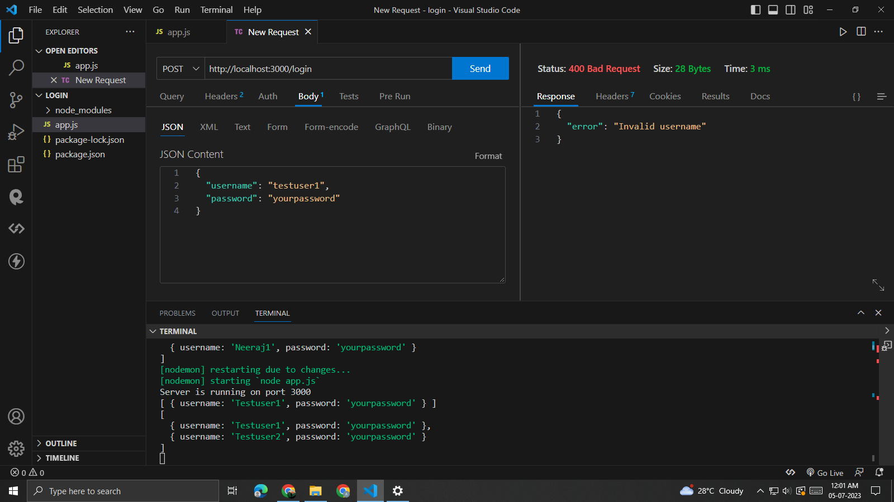

---

# API Examples

This repository contains examples of APIs implemented in Node.js.

**Note: Before running the API examples, make sure to install the required dependencies by running `npm i` in the app directory.**

## A. User Login API

This API allows users to log in using a username and password. The API enforces certain requirements for the username and password as follows:

- The username must be alphanumeric.
- The username must be between 6 and 12 characters in length.
- The password can include alphabets, numbers, and special characters.
- The password must be at least 6 characters long.

To use this API, make a POST request to the `/login` endpoint with the following JSON payload:

```json
{
  "username": "your-username",
  "password": "your-password"
}
```

- **Request Successful**  <br>
   <br> <br>
- **Request Failed**  <br>
   <br> <br

## B. Sorted Fruit List API

This API provides a sorted list of fruits based on their color. It uses a `Fruit` class with the following fields: `id`, `name`, and `color`. The API endpoint `/fruits` returns a sorted list of `Fruit` objects based on the color field.

To use this API, make a POST request to the `/fruits` endpoint with the following JSON payload containing an array of fruits:

```json
[
  {
    "id": 1,
    "name": "Apple",
    "color": "Red"
  },
  {
    "id": 2,
    "name": "Banana",
    "color": "Yellow"
  },
  ...
]
```

- **Request Successful**  <br>
   <br> <br>
- **Request Failed**  <br>
   <br> <br>

---
